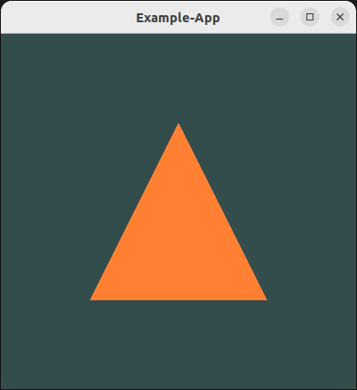

# Qt/OpenGL Template

# About

This template is an example as to how to build a Qt GUI around a view that is
renderer with OpenGL.



There are many similar examples out there, but they tend to mix business logic
with the GUI logic. I don't think that is the proper way to do things. The core
application should be as independent of the UI as possible. To that end, the 
source code in this example is clearly split in two parts:

- `Source/Gui` contains **Qt-dependent UI layer code** and is **written in C++**
- `Source/Renderer` contains **OpenGL-dependent application layer code** and is **written in C**

In other words, `Renderer` does not depend on `Gui` and therefore Qt in any way.
We simply use implement `Gui` with Qt as our framework of choice. We could just
as well use any other GUI framework if we wanted to.

This example uses GL3W to load OpenGL functions.

## Build & run (Linux)

```
Scripts/bootstrap
cmake -B build -S .
cmake --build build
./build/bin/Example-App
```
